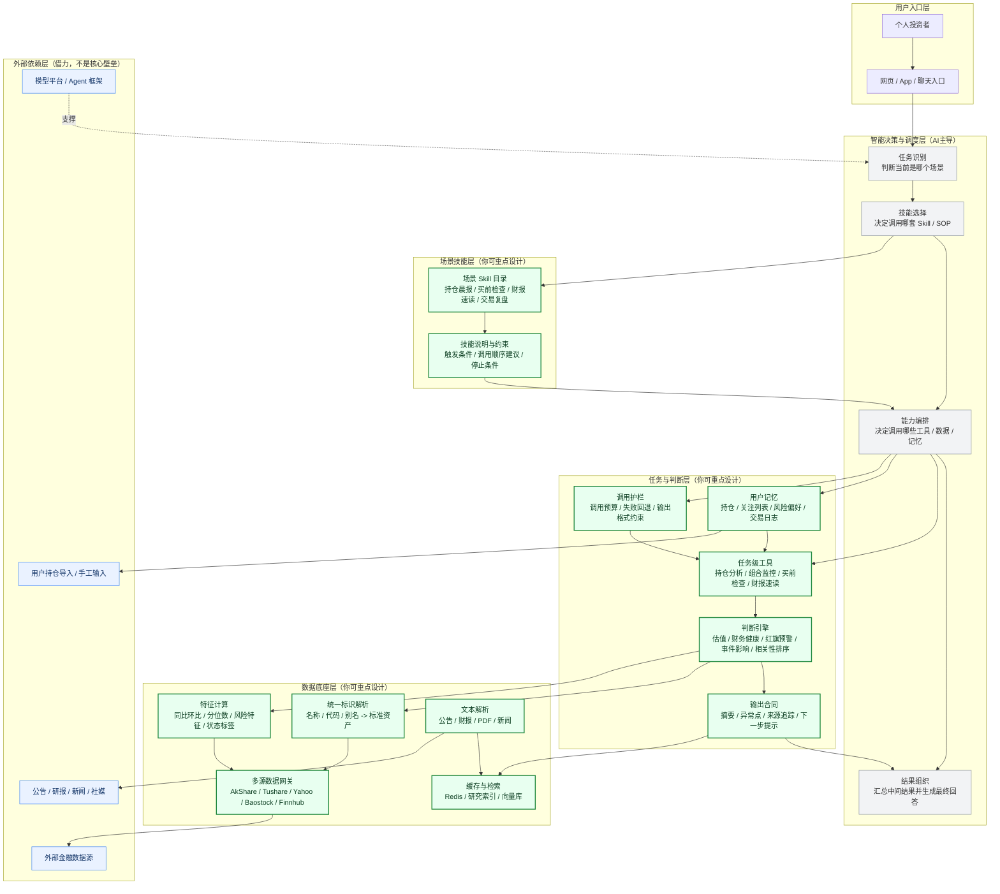

# Stock Tool MCP Server

<div align="center">

**[English](#english-documentation) | 中文文档**

一个强大且全面的模型上下文协议 (MCP) 服务器，专注于金融市场数据、技术分析和基本面研究。

**遇到问题？扫码进群交流**


</div>

---

## 🇨🇳 中文文档

### 📖 项目简介

本项目旨在为 AI Agent（如 Claude, Cursor, 通义千问等）赋予专业级的股市分析能力，打通大语言模型与实时金融数据之间的桥梁。

通过 **MCP (Model Context Protocol)** 协议，AI 可以直接调用本服务器提供的金融工具，实现：
- 📊 实时行情查询
- 📈 技术指标计算
- 💰 基本面分析
- 📰 新闻资讯获取
- 🔍 深度研究报告

### 🚀 核心功能

#### 1. 多源市场数据融合

无需纠结使用哪个 API。本服务器内置智能 **Adapter Manager（适配器管理器）**，可自动路由请求并在多个数据源之间进行故障转移。

**数据源列表**

| 类别 | 数据源 | 市场 | 费用 | API Key |
|------|--------|------|------|---------|
| **A股** | Tushare | 沪深北 | 积分制 | ✅ |
| | Akshare | A股+港股 | 免费 | ❌ |
| | Baostock | A股 | 免费 | ❌ |
| **美股** | Yahoo Finance | 美股+港股+国际 | 免费 | ❌ |
| | Finnhub | 美股 | Freemium | ✅ |
| **加密货币** | CCXT | 全球交易所 | 免费 | ✅ |
| **外汇/大宗** | Alpha Vantage | 全球 | Freemium | ✅ |
| | Twelve Data | 全球 | Freemium | ✅ |
| **宏观** | FRED | 美国宏观 | 免费 | ✅ |
| **SEC文件** | Edgar | 美股财报 | 免费 | ❌ |

**数据维度**

- 📊 **行情数据**: OHLCV/历史K线/盘口/复权
- 💰 **基本面数据**: 三大财报/财务指标/主营构成/股东/分红
- 💸 **资金流向**: 个股资金流/北向资金/板块资金/筹码分布
- 📰 **资讯研报**: 新闻/业绩预告/机构评级/研报
- 🌐 **宏观数据**: 中美CPI/GDP/M2/利率/失业率
- 🔢 **技术指标**: 20+指标 (SMA/EMA/RSI/MACD/KDJ/ATR/布林带等)
- 📈 **形态识别**: K线形态自动检测

**智能路由**

1. **市场优先级**: A股: Tushare → Akshare → Baostock
2. **时效优先级**: 实时数据→付费源，历史数据→免费源
3. **健康检查**: 自动故障转移 + 冷却恢复
4. **配额管理**: 智能轮换避免限流

> 📖 **详细文档**: [数据源与数据维度详解](docs/DATA_SOURCES.md) - 包含完整的数据源矩阵、实现状态和开发计划

#### 2. 专业技术分析

内置量化分析引擎，提供的不仅仅是原始数字：

- **技术指标**: SMA/EMA, RSI, MACD, 布林带 (Bollinger Bands), KDJ, ATR 等
- **形态识别**: 自动检测 K 线形态（如十字星 Doji, 锤头线 Hammer, 吞没形态 Engulfing）
- **支撑与压力**: 动态计算关键价格位
- **筹码分布 (Volume Profile)**: 分析成交量分布以识别价值区域

#### 3. 深度基本面研究

自动化的金融分析师能力：

- **财务报表**: 资产负债表、利润表、现金流量表
- **健康度打分**: 基于盈利能力、偿债能力、成长性和估值的 0-100 分独家健康度评分
- **关键比率**: PE, PB, ROE, ROA, 负债权益比等

#### 4. 智能聚合工具

专为 LLM 上下文窗口优化：

- `perform_deep_research`: 一键获取指定标的的 价格 + 历史走势 + 基本面 + 近期新闻
- `get_market_report`: 获取当前市场状态的综合快照

### 🛠️ 安装指南

#### 前置要求

- Python 3.10+
- Redis (可选，用于缓存)

#### 安装步骤

1. **克隆仓库**
   ```bash
   git clone https://github.com/yourusername/stock-tool-mcp.git
   cd stock-tool-mcp
   ```

2. **创建并激活 Conda 环境**
   ```bash
   # 创建 Python 3.11.14 环境
   conda create -n stock-mcp python=3.11.14
   
   # 激活环境
   conda activate stock-mcp
   ```

3. **安装依赖**
   ```bash
   pip install -r requirements.txt
   ```

4. **配置环境变量**
   
   复制示例环境变量文件:
   ```bash
   cp .env.example .env
   ```
   
   编辑 `.env` 添加你的 API 密钥（可选，但推荐以获得更高限额）:
   - `TUSHARE_ENABLED` - 是否启用 Tushare 数据源（默认 False）
   - `TUSHARE_TOKEN` - 用于 A 股数据（[获取 Token](https://tushare.pro/register)）
   - `TUSHARE_HTTP_URL` - 可选，自定义 Tushare 接口地址（私有部署/镜像）
   - `FINNHUB_ENABLED` - 是否启用 Finnhub 数据源（默认 False）
   - `FINNHUB_API_KEY` - 用于美股机构数据（[获取 API Key](https://finnhub.io/)）
   - `FRED_API_KEY` - 用于美股宏观指标（GDP/CPI/失业率/利率，免费申请，[获取 API Key](https://fred.stlouisfed.org/docs/api/api_key.html)）
   - `DASHSCOPE_API_KEY` - 用于阿里百炼 AI（可选，用于测试）

   > **💡 提示**: 本项目采用**可插拔设计**。如果没有配置 API Key，系统会自动禁用相应的数据源，并使用免费的替代方案（如 Akshare, Baostock, Yahoo Finance）作为后备。

### 🏃‍♂️ 使用方法

#### 方式一：作为 HTTP 服务器运行（推荐用于测试和开发）

使用 uvicorn 启动 MCP 服务器（Streamable HTTP 模式）：

```bash
# 设置环境变量指定传输方式为 streamable-http
export MCP_TRANSPORT=streamable-http

# 标准启动（监听 9898 端口）
uv run python -m uvicorn src.server.app:app --host 0.0.0.0 --port 9898

# 开发模式（支持热重载）
MCP_TRANSPORT=streamable-http python -m uvicorn src.server.app:app --reload --port 9898
```

启动成功后，你会看到：
```
✅ MCP server ready!
```

**使用示例（Streamable HTTP）**：


#### 方式二：使用 stdio 模式（推荐用于 AI Agent 集成）

stdio 模式通过标准输入输出与 AI Agent 通信，适合 Claude Desktop、Cursor 等本地集成。

**快速启动**：
```bash
# 使用启动脚本（已配置好 conda 环境）
bash start_stock_mcp_stdio.sh
```

**手动启动**：
```bash
# 激活 conda 环境
conda activate stock-mcp

# 启动 stdio 模式（默认传输方式）
python -c "import src.server.mcp.server as m; m.create_mcp_server().run(transport='stdio')"
```

**集成到 Claude Desktop** (`~/Library/Application Support/Claude/claude_desktop_config.json`):
```json
{
  "mcpServers": {
    "stock-tools": {
      "command": "bash",
      "args": ["start_stock_mcp_stdio.sh"],
      "cwd": "/path/to/stock-tool-mcp"
    }
  }
}
```

**集成到 Cursor** (`.cursor/mcp_config.json`):
```json
{
  "mcpServers": {
    "stock-tools": {
      "command": "bash",
      "args": ["start_stock_mcp_stdio.sh"],
      "cwd": "/path/to/stock-tool-mcp"
    }
  }
}
```

**使用示例（stdio 模式）**：


#### 方式三：通过 HTTP API 调用

服务器启动后，可以通过 HTTP 接口调用（Streamable HTTP 协议）：

```bash
# 列出所有可用工具
curl -X POST http://localhost:9898 \
  -H "Content-Type: application/json" \
  -d '{
    "jsonrpc": "2.0",
    "method": "tools/list",
    "params": {},
    "id": "1"
  }'

# 调用工具示例：查询贵州茅台价格
curl -X POST "http://localhost:9898/?_tool=get_kline_data" \
  -H "Content-Type: application/json" \
  -d '{
    "jsonrpc": "2.0",
    "method": "tools/call",
    "params": {
      "name": "get_kline_data",
      "arguments": {
        "ticker": "SSE:600519"
      }
    },
    "id": "2"
  }'
```

### 🧰 可用工具一览

> 实际启用的工具以 MCP 注册表为准（`src/server/mcp/registry.py`），当前共 **120 个 MCP 工具**。

| 工具名称                         | 描述                                   | 示例参数                                                                         |
| -------------------------------- | -------------------------------------- | -------------------------------------------------------------------------------- |
| `search_assets`                  | 通过名称或代码搜索股票、加密货币或 ETF | `{"query": "茅台", "limit": 5}`                                                  |
| `get_asset_info`                 | 获取资产基本信息（名称/交易所/行业/市值） | `{"ticker": "SSE:600519"}`                                                       |
| `get_real_time_price`            | 获取实时价格                           | `{"ticker": "SSE:600519"}`                                                       |
| `get_multiple_prices`            | 批量获取多个资产实时价格               | `{"tickers": ["SSE:600519", "SZSE:000858"]}`                                     |
| `get_kline_data`                 | 获取指定日期范围的 OHLCV 数据          | `{"ticker": "SSE:600519", "start_date": "2024-01-01", "end_date": "2024-12-31"}` |
| `get_technical_indicators`       | 计算技术指标 (RSI, MACD 等)            | `{"symbol": "SSE:600519", "period": "90d", "interval": "1d"}`                    |
| `get_technical_signals`          | 获取确定性技术信号 (RSI/MACD/布林带)   | `{"symbol": "SSE:600519"}`                                                       |
| `get_financial_reports`          | 财务图表（营收/净利润）                | `{"symbol": "SSE:600519"}`                                                       |
| `get_profit_forecast`            | 盈利预测（机构一致预期）               | `{"symbol": "SSE:600519"}`                                                       |
| `get_financial_ratios`           | 关键财务比率（PE/PB/ROE等）            | `{"symbol": "SSE:600519"}`                                                       |
| `get_stock_financial_statements` | 财报三表（利润表/资产负债表/现金流量表）| `{"symbol": "SSE:600519"}`                                                       |
| `get_mainbz_info`                | 主营业务构成                           | `{"symbol": "SSE:600519"}`                                                       |
| `get_shareholder_info`           | 股东信息                               | `{"symbol": "SSE:600519"}`                                                       |
| `get_dividend_info`              | 分红送股历史                           | `{"symbol": "SSE:600519"}`                                                       |
| `get_money_flow`                 | 个股资金流向                           | `{"symbol": "SSE:600519", "days": 20}`                                           |
| `get_north_bound_flow`           | 北向资金流向                           | `{"days": 30}`                                                                   |
| `get_stock_fact_pack`            | 股票事实包（10+类别聚合）              | `{"symbol": "600519"}`                                                           |
| `get_fund_fact_pack`             | 基金事实包（8类别聚合）                | `{"fund_code": "110011"}`                                                        |
| `get_market_fact_pack`           | 市场事实包（10类别聚合）               | `{"symbol": "600519"}`                                                           |
| `get_us_stock_fact_pack`         | 美股事实包（10类别聚合）               | `{"ticker": "AAPL"}`                                                             |
| `get_etf_fact_pack`              | ETF事实包（10类别聚合）                | `{"symbol": "510300"}`                                                           |
| `get_index_fact_pack`            | 指数事实包（10类别聚合）               | `{"symbol": "000300"}`                                                           |

> **💡 重要提示**: 
> - A股股票代码格式：`SSE:600519`（上交所）、`SZSE:000001`（深交所）
> - 美股股票代码格式：`NASDAQ:AAPL`、`NYSE:TSLA`
> - 加密货币格式：`CRYPTO:BTC`、`CRYPTO:ETH`

### 📸 实际使用示例

本项目支持两种传输协议，分别适用于不同场景：

#### 1. Streamable HTTP 模式
适合通过 HTTP 接口调用，方便测试和集成到 Web 应用：


#### 2. stdio 模式
适合直接集成到 AI Agent（如 Claude Desktop、Cursor），通过标准输入输出通信：


> **💡 两种模式的区别**：
> - **Streamable HTTP**: 需要启动 Web 服务器，支持远程调用，适合生产环境
> - **stdio**: 直接进程通信，无需网络端口，适合本地 AI Agent 集成，延迟更低

### 🧪 测试脚本

项目提供了完整的测试脚本，帮助你快速验证功能：

#### 1. HTTP 接口测试

使用 `scripts/test_mcp_refactor.py` 做快速自检（MCP + REST）：

```bash
# 1. 启动 MCP 服务器（在一个终端）
python -m uvicorn src.server.app:app --host 0.0.0.0 --port 9898

# 2. 在另一个终端运行测试脚本
NO_PROXY=localhost,127.0.0.1 python scripts/test_mcp_refactor.py
```

该脚本会：
- ✅ 连接到 MCP 服务器（http://localhost:9898）
- ✅ 列出所有可用工具
- ✅ 使用阿里百炼（通义千问）调用工具
- ✅ 查询贵州茅台的价格和基本面

#### 2. OpenAPI 文档生成

使用 `scripts/mcp2openapi.py` 生成 OpenAPI 规范文档：

```bash
python scripts/mcp2openapi.py
```

生成的 OpenAPI 文档可以导入到 Apifox、Postman 等工具中进行测试。

### 🗺️ 路线图与未来计划

#### ✅ 已完成功能 (v1.0)

- [x] **多源数据融合**: Adapter Manager 智能路由 + 自动故障转移
- [x] **实时行情**: OHLCV + 成交量数据
- [x] **技术分析引擎**: 20+ 技术指标 + K线形态识别 + 确定性信号
- [x] **基本面数据**: 财务报表/主营构成/股东信息/分红历史/盈利预测/财务比率
- [x] **资金流向**: 个股资金流/北向资金/板块资金流/龙虎榜/融资融券
- [x] **宏观数据**: 中美宏观指标 (CPI/GDP/M2/利率等)
- [x] **新闻资讯**: 公司新闻/行业动态
- [x] **完整财报三表**: 利润表/资产负债表/现金流量表 + YoY/QoQ (v1.1, 2026-03-24)
- [x] **120个MCP工具**: 18个工具组覆盖A股/美股/基金/ETF/指数/行业/宏观全品类 (v2.0)
- [x] **6类Fact Pack**: 股票/基金/行情/美股/ETF/指数 聚合事实包，AI-ready结构化数据
- [x] **Markdown输出层**: 所有工具支持 markdown/json 双格式输出
- [x] **统一REST+MCP双协议**: REST API + MCP 共享业务用例，支持 `?format=markdown`
- [x] **Preview Workbench**: 可视化数据预览台，按6大类分组（宏观/行业/A股/美股/基金/指数ETF）
- [x] **API文档**: Swagger UI (`/docs`) + Scalar API Reference (`/api-docs`)

#### 🚧 开发中 (v1.2)

- [ ] **深度行业研究编排**: 行业定位/个股扫描/同业对比/证据收集工作流
- [ ] **高级形态识别**: 更多K线形态与量价形态
- [ ] **期权数据**: Greeks/隐含波动率/PCR

#### 📋 计划中 (v1.3+)

- [ ] **实盘交易执行**: 通过 CCXT (加密货币) 和券商 API (股票) 集成真实下单能力
- [ ] **高级缓存策略**: 区分实时数据 (短TTL) 和财报数据 (长TTL)
- [ ] **用户账户管理**: 安全存储用户特定的交易所 API 密钥
- [ ] **WebSocket 实时推送**: 减少轮询开销，支持实时行情订阅
- [ ] **回测引擎**: 内置策略回测功能，支持历史数据验证
- [ ] **更多数据源**:
  - 情绪分析: Twitter/Reddit 舆情
  - 另类数据: 卫星图像/信用卡数据
  - 期权数据: Greeks/隐含波动率
  - 债券数据: 国债/企业债收益率

#### 🎯 长期愿景

- **多语言 SDK**: Python/JavaScript/Go 客户端库
- **云端部署**: Docker + Kubernetes 一键部署
- **企业版**: 多租户/权限管理/审计日志
- **AI 策略助手**: 自然语言生成交易策略

### 🏗️ 项目架构

本项目采用 **DDD + 分层架构**，并同时支持 REST 与 MCP 两种协议入口。

```
src/server/
├── app.py                 # FastAPI + MCP 入口
├── api/                   # REST API 层（routes + request models）
├── mcp/                   # MCP 协议层
│   ├── registry.py        # MCP 工具注册表（单一来源）
│   └── tools/             # MCP 工具定义
├── core/                  # 应用层（启动、DI、用例编排）
│   ├── bootstrap.py        # 启动初始化（连接/适配器注册）
│   ├── dependencies.py     # 依赖注入容器
│   └── use_cases/          # 统一业务用例（MCP/REST 共享）
├── domain/                # 领域层（核心能力）
│   ├── market_gateway.py   # 统一网关（解析 + 路由入口）
│   ├── adapter_manager.py  # 多源适配管理与 failover
│   ├── adapters/          # 数据适配器（Akshare/Tushare/Baostock/Yahoo/Finnhub/CCXT/TwelveData）
│   ├── symbols/           # 符号标准化（EXCHANGE:SYMBOL）
│   ├── routing/           # 路由策略 + 健康跟踪 + 冷却
│   └── security_master/   # 资产主数据（listing/alias/identifier/provider_symbol）
├── infrastructure/        # 基础设施层
│   ├── connections/       # Redis/Postgres/Tushare/Finnhub/Baostock 连接
│   └── cache/             # 缓存封装
├── config/                # 配置与策略（settings/routing_policy/aliases_seed）
└── utils/                 # 工具类
```

**核心设计原则**:
- 📦 **适配器模式**: 统一多数据源接口，屏蔽供应商差异
- 🔌 **依赖注入**: 使用 `dependency-injector` 管理服务生命周期
- 🧭 **配置化路由**: 按 `asset_type + exchange + data_type` 选择 provider
- 🛡️ **容错优先**: 健康跟踪 + cooldown + fallback 多层保障
- 🧩 **符号标准化**: 统一到 `EXCHANGE:SYMBOL`，并沉淀 alias/canonical_id

**请求主链路（简版）**:
1. API/MCP 接收请求 -> use_case
2. `MarketGateway` 调 `SymbolResolver` 做标准化与错误语义统一
3. `SymbolResolver` 持久化主数据（`asset/listing/alias/identifier`）
4. `MarketRouter` 按策略选源并结合健康状态执行调用
5. 全部失败回退 `AdapterManager` legacy 路由

完整时序图见: [`docs/request-flow-mermaid.md`](docs/request-flow-mermaid.md)

### 🧠 面向个人投资者的 AI 系统架构（规划）

如果将 `stock-mcp` 从通用金融 MCP 底座进一步演进为面向个人投资者的产品内核，推荐采用“**AI 负责判断与调度，你负责设计技能、工具、判断逻辑、记忆与数据环境**”的架构。这样可以避免和通用大模型、通用 Agent 框架正面竞争，把壁垒沉淀在金融垂直能力里。

下图中：
- `绿色`：你可以重点设计和持续优化的部分
- `灰色`：由 AI 主导的任务识别、技能选择与调度
- `蓝色`：外部依赖与数据来源



**推荐的职责边界**

- `AI 负责`：识别任务场景、选择要走的 Skill、决定调用顺序、组织最终回答。
- `你负责`：把金融垂直逻辑沉淀成稳定的 Skill、任务级工具、判断引擎、用户记忆结构、统一输出合同与调用护栏。
- `外部依赖负责`：提供模型能力、原始数据、公告研报和用户输入来源。

**为什么这样设计**

- 避免把系统做成“纯底层数据接口”或“纯通用 Agent 壳子”。
- 让壁垒沉淀在你真正能控制的部分：数据质量、金融判断逻辑、场景 SOP、输出确定性。
- 让任何支持 MCP / Skill 的智能体接入后，都更容易“选对工具、调对数据、产出对结论”。

**最值得优先建设的模块**

1. `场景 Skill 目录`：把持仓晨报、买前检查、财报速读、交易复盘写成明确 SOP。
2. `任务级工具`：不要暴露一堆底层 API，要暴露“持仓分析”“组合监控”这类任务能力。
3. `判断引擎`：把“贵不贵、有没有雷、这条消息重不重要”前置成稳定逻辑。
4. `输出合同`：统一摘要、异常点、来源追踪和下一步提示，避免把原始 JSON 直接扔给模型。
5. `用户记忆`：持仓、关注列表、风险偏好、交易日志，是形成个人投资者留存的关键。

### 📄 许可证

MIT License

---

<a name="english-documentation"></a>

## 🇬🇧 English Documentation

### 📖 Introduction

A powerful, comprehensive Model Context Protocol (MCP) server for financial market data, technical analysis, and fundamental research.

Designed to empower AI agents (like Claude, Cursor, etc.) with professional-grade stock market capabilities, bridging the gap between LLMs and real-time financial data.

### 🚀 Features

#### 1. Multi-Source Market Data

Stop worrying about which API to use. The server features a smart **Adapter Manager** that automatically routes requests and handles failover across multiple providers:

- **US Stocks**: Yahoo Finance, Finnhub
- **China A-Shares**: Akshare, Tushare, Baostock
- **Crypto**: CCXT (Binance, OKX, etc.)
- **Forex & Indices**: Yahoo Finance

#### 2. Professional Technical Analysis

Built-in quantitative analysis engine providing more than just raw numbers:

- **Indicators**: SMA/EMA, RSI, MACD, Bollinger Bands, KDJ, ATR
- **Pattern Recognition**: Automatically detects candlestick patterns (Doji, Hammer, Engulfing)
- **Support & Resistance**: Dynamic calculation of key price levels
- **Volume Profile**: Analysis of volume distribution to identify value areas
- **Technical Signals**: Deterministic RSI/MACD/Bollinger signal states (overbought/oversold, golden/death cross)

#### 3. Deep Fundamental Research

Automated financial analyst capabilities:

- **Financial Statements**: Balance Sheet, Income Statement, Cash Flow
- **Health Scoring**: 0-100 proprietary health score based on Profitability, Solvency, Growth, and Valuation
- **Key Ratios**: PE, PB, ROE, ROA, Debt-to-Equity, and more
- **Earnings Estimates**: Analyst consensus profit forecasts via MCP tool

#### 4. Smart Aggregation Tools

Optimized for LLM context windows:

- `perform_deep_research`: One-shot tool to fetch price, history, fundamentals, and recent news for a symbol
- `get_market_report`: A comprehensive snapshot of the current market status

#### 5. Fact Pack Aggregation (6 entity types)

AI-ready structured data packs that aggregate 10+ data categories per entity:

- **Stock Fact Pack**: Security master + financials + market + governance + events + earnings estimates + business structure + company master + peers + restricted release + repurchase (11 categories)
- **Fund Fact Pack**: Master + NAV/performance + holdings + manager + scale + fees + peer comparison (7 categories)
- **Market Fact Pack**: Valuation + technical snapshot + K-line + money flow + breadth + index/sector + derivatives + relative strength + north bound + margin (10 categories)
- **US Stock Fact Pack**: Profile + financials + technicals + institutional + analyst + news (6 categories)
- **ETF Fact Pack**: Master + flow + holdings + performance (4 categories)
- **Index Fact Pack**: Master + valuation + performance (3 categories)

Each fact pack includes:
- Structured `facts` dict organized by category
- `coverage` status (complete/partial/missing) per category
- `source_trace` for data provenance
- `fact_markdown` human-readable view optimized for LLM context

#### 6. Dual Protocol Access (MCP + REST)

All 120+ tools are accessible via both MCP (for AI agents) and REST API (for web apps):

- **MCP**: Streamable HTTP or stdio, for Claude/Cursor/other AI agents
- **REST API**: Standard HTTP JSON at `/api/v1/*`, with Swagger UI at `/docs` and Scalar API Reference at `/api-docs`
- **Markdown output**: All REST endpoints support `?format=markdown` for human-readable responses
- **Preview Workbench**: Interactive data explorer at `/` with categorized method catalog

### 🛠️ Installation

#### Prerequisites

- Python 3.10+
- Redis (optional, for caching)

#### Setup

1. **Clone the repository**
   ```bash
   git clone https://github.com/yourusername/stock-tool-mcp.git
   cd stock-tool-mcp
   ```

2. **Create and activate Conda environment**
   ```bash
   # Create Python 3.11.14 environment
   conda create -n stock-mcp python=3.11.14
   
   # Activate environment
   conda activate stock-mcp
   ```

3. **Install dependencies**
   ```bash
   pip install -r requirements.txt
   ```

4. **Configuration**
   
   Copy the example environment file:
   ```bash
   cp .env.example .env
   ```
   
   Edit `.env` to add your API keys (optional but recommended for higher limits):
   - `TUSHARE_ENABLED` - Enable Tushare data source (default: False)
   - `TUSHARE_TOKEN` - For China A-shares data ([Get Token](https://tushare.pro/register))
   - `TUSHARE_HTTP_URL` - Optional custom Tushare endpoint (private deployment/mirror)
   - `FINNHUB_ENABLED` - Enable Finnhub data source (default: False)
   - `FINNHUB_API_KEY` - For US institutional data ([Get API Key](https://finnhub.io/))
   - `FRED_API_KEY` - For US macro indicators (GDP/CPI/Unemployment/Rates, free key, [Get API Key](https://fred.stlouisfed.org/docs/api/api_key.html))
   - `DASHSCOPE_API_KEY` - For Alibaba Cloud AI (optional, for testing)

   > **💡 Note**: This project features a **pluggable design**. If API keys are not configured, the system will automatically disable the corresponding data sources and use free alternatives (like Akshare, Baostock, Yahoo Finance) as fallbacks.

### 🏃‍♂️ Usage

#### Method 1: Run as HTTP Server (Recommended for Testing & Development)

Start the MCP server using uvicorn (Streamable HTTP mode):

```bash
# Set environment variable to specify transport mode
export MCP_TRANSPORT=streamable-http

# Standard run (listening on port 9898)
python -m uvicorn src.server.app:app --host 0.0.0.0 --port 9898

# Development mode (with hot reload)
MCP_TRANSPORT=streamable-http python -m uvicorn src.server.app:app --reload --port 9898
```

After successful startup, you'll see:
```
✅ MCP server ready!
```

**Example (Streamable HTTP mode)**:


#### Method 2: Use stdio Mode (Recommended for AI Agent Integration)

stdio mode communicates with AI agents via standard input/output, suitable for local integration with Claude Desktop, Cursor, etc.

**Quick Start**:
```bash
# Use the startup script (conda environment pre-configured)
bash start_stock_mcp_stdio.sh
```

**Manual Start**:
```bash
# Activate conda environment
conda activate stock-mcp

# Start stdio mode (default transport)
python -c "import src.server.mcp.server as m; m.create_mcp_server().run(transport='stdio')"
```

**Integrate with Claude Desktop** (`~/Library/Application Support/Claude/claude_desktop_config.json`):
```json
{
  "mcpServers": {
    "stock-tools": {
      "command": "bash",
      "args": ["start_stock_mcp_stdio.sh"],
      "cwd": "/path/to/stock-tool-mcp"
    }
  }
}
```

**Integrate with Cursor** (`.cursor/mcp_config.json`):
```json
{
  "mcpServers": {
    "stock-tools": {
      "command": "bash",
      "args": ["start_stock_mcp_stdio.sh"],
      "cwd": "/path/to/stock-tool-mcp"
    }
  }
}
```

**Example (stdio mode)**:


#### Method 3: HTTP API Calls

After starting the server, you can call it via HTTP interface (Streamable HTTP protocol):

```bash
# List all available tools
curl -X POST http://localhost:9898 \
  -H "Content-Type: application/json" \
  -d '{
    "jsonrpc": "2.0",
    "method": "tools/list",
    "params": {},
    "id": "1"
  }'

# Call tool example: Query Moutai stock price
curl -X POST "http://localhost:9898/?_tool=get_kline_data" \
  -H "Content-Type: application/json" \
  -d '{
    "jsonrpc": "2.0",
    "method": "tools/call",
    "params": {
      "name": "get_kline_data",
      "arguments": {
        "ticker": "SSE:600519"
      }
    },
    "id": "2"
  }'
```

### 🧰 Available Tools

> The actual enabled tools are defined in the MCP registry (`src/server/mcp/registry.py`). Currently **120 MCP tools** across 18 tool groups.

| Tool Name                        | Description                                                      | Example Parameters                                                               |
| -------------------------------- | ---------------------------------------------------------------- | -------------------------------------------------------------------------------- |
| `search_assets`                  | Search for stocks, crypto, or ETFs by name or ticker             | `{"query": "Moutai", "limit": 5}`                                               |
| `get_asset_info`                 | Get asset basic info (name/exchange/industry/market_cap)         | `{"ticker": "SSE:600519"}`                                                       |
| `get_real_time_price`            | Get real-time price                                               | `{"ticker": "SSE:600519"}`                                                       |
| `get_multiple_prices`            | Batch real-time prices for multiple assets                       | `{"tickers": ["SSE:600519", "SZSE:000858"]}`                                     |
| `get_kline_data`                 | Fetch OHLCV data for a specific date range                       | `{"ticker": "SSE:600519", "start_date": "2024-01-01", "end_date": "2024-12-31"}` |
| `get_technical_indicators`       | Compute technical indicators (RSI, MACD, etc.)                   | `{"symbol": "SSE:600519", "period": "90d", "interval": "1d"}`                    |
| `get_technical_signals`          | Deterministic signals (RSI/MACD/Bollinger states)                | `{"symbol": "SSE:600519"}`                                                       |
| `get_financial_reports`          | Revenue & net income charts                                      | `{"symbol": "SSE:600519"}`                                                       |
| `get_profit_forecast`            | Analyst consensus earnings estimates                             | `{"symbol": "SSE:600519"}`                                                       |
| `get_financial_ratios`           | Key ratios (PE/PB/ROE/ROA etc.)                                  | `{"symbol": "SSE:600519"}`                                                       |
| `get_mainbz_info`                | Main business composition                                        | `{"symbol": "SSE:600519"}`                                                       |
| `get_shareholder_info`           | Shareholder information                                          | `{"symbol": "SSE:600519"}`                                                       |
| `get_dividend_info`              | Dividend history                                                 | `{"symbol": "SSE:600519"}`                                                       |
| `get_money_flow`                 | Money flow for a stock                                           | `{"symbol": "SSE:600519", "days": 20}`                                           |
| `get_north_bound_flow`           | Northbound capital flow                                          | `{"days": 30}`                                                                   |
| `get_stock_fact_pack`            | Stock aggregated facts (11 categories)                           | `{"symbol": "600519"}`                                                           |
| `get_fund_fact_pack`             | Fund aggregated facts (8 categories)                             | `{"fund_code": "110011"}`                                                        |
| `get_market_fact_pack`           | Market aggregated facts (10 categories)                          | `{"symbol": "600519"}`                                                           |
| `get_us_stock_fact_pack`         | US stock aggregated facts (10 categories)                        | `{"ticker": "AAPL"}`                                                             |
| `get_etf_fact_pack`              | ETF aggregated facts (10 categories)                             | `{"symbol": "510300"}`                                                           |
| `get_index_fact_pack`            | Index aggregated facts (10 categories)                           | `{"symbol": "000300"}`                                                           |

> **💡 Important Note**: 
> - A-share ticker format: `SSE:600519` (Shanghai), `SZSE:000001` (Shenzhen)
> - US stock ticker format: `NASDAQ:AAPL`, `NYSE:TSLA`
> - Crypto format: `CRYPTO:BTC`, `CRYPTO:ETH`

### 📸 Real-World Examples

This project supports two transport protocols, each suitable for different scenarios:

#### 1. Streamable HTTP Mode
Suitable for HTTP interface calls, convenient for testing and integration into web applications:


#### 2. stdio Mode
Suitable for direct integration into AI Agents (like Claude Desktop, Cursor), communicating via standard input/output:


> **💡 Differences Between the Two Modes**:
> - **Streamable HTTP**: Requires a web server, supports remote calls, suitable for production environments
> - **stdio**: Direct process communication, no network port required, suitable for local AI Agent integration with lower latency

### 🧪 Test Scripts

The project provides comprehensive test scripts to help you quickly verify functionality:

#### 1. HTTP Interface Testing

Use `scripts/test_mcp_refactor.py` for quick MCP + REST sanity checks:

```bash
# 1. Start the MCP server (in one terminal)
python -m uvicorn src.server.app:app --host 0.0.0.0 --port 9898

# 2. Run the test script in another terminal
NO_PROXY=localhost,127.0.0.1 python scripts/test_mcp_refactor.py
```

This script will:
- ✅ Connect to the MCP server (http://localhost:9898)
- ✅ List all available tools
- ✅ Use Alibaba Cloud Qwen to call tools
- ✅ Query Moutai's price and fundamentals

#### 2. OpenAPI Documentation Generation

Use `scripts/mcp2openapi.py` to generate OpenAPI specification:

```bash
python scripts/mcp2openapi.py
```

The generated OpenAPI documentation can be imported into tools like Apifox or Postman for testing.

### 🗺️ Roadmap & Future Plans

#### ✅ Completed Features (v1.0)

- [x] **Multi-Source Data Fusion**: Adapter Manager with smart routing + automatic failover
- [x] **Real-time Quotes**: OHLCV + volume data
- [x] **Technical Analysis Engine**: 20+ indicators + candlestick pattern recognition + deterministic signals
- [x] **Fundamental Data**: Financial statements / business composition / shareholders / dividends / profit forecasts / financial ratios
- [x] **Money Flow**: Individual stock flow / northbound capital / sector flows / margin trading / dragon-tiger list
- [x] **Macro Indicators**: China & US macro data (CPI/GDP/M2/rates etc.)
- [x] **News & Updates**: Company news / industry trends
- [x] **Complete Financial Statements**: Income/Balance Sheet/Cash Flow + YoY/QoQ (v1.1, 2026-03-24)
- [x] **120 MCP Tools**: 18 tool groups covering A-shares/US stocks/funds/ETFs/indices/sectors/macro (v2.0)
- [x] **6 Fact Pack Types**: Stock/Fund/Market/US Stock/ETF/Index aggregated fact packs, AI-ready structured data
- [x] **Markdown Output**: All tools support markdown/json dual format output
- [x] **Unified REST+MCP**: REST API + MCP share business use cases, supports `?format=markdown`
- [x] **Preview Workbench**: Visual data explorer with 6 category tabs
- [x] **API Docs**: Swagger UI (`/docs`) + Scalar API Reference (`/api-docs`)

#### 🚧 In Development (v1.2)

- [ ] **Deep Sector Research Orchestration**: Sector scoping / stock screening / peer comparison / evidence collection workflow
- [ ] **Advanced Pattern Recognition**: More candlestick & volume-price patterns
- [ ] **Options Data**: Greeks / implied volatility / PCR

#### 📋 Planned (v1.3+)

- [ ] **Real Trading Execution**: Integrate real order placement via CCXT (crypto) and broker APIs (stocks)
- [ ] **Advanced Caching Strategy**: Distinguish real-time data (short TTL) from financial reports (long TTL)
- [ ] **User Account Management**: Secure storage of user-specific exchange API keys
- [ ] **WebSocket Real-time Push**: Reduce polling overhead, support real-time quote subscriptions
- [ ] **Backtesting Engine**: Built-in strategy backtesting with historical data validation
- [ ] **More Data Sources**:
  - Sentiment Analysis: Twitter/Reddit sentiment
  - Alternative Data: Satellite imagery / credit card data
  - Options Data: Greeks / implied volatility
  - Bond Data: Treasury / corporate bond yields

#### 🎯 Long-term Vision

- **Multi-language SDK**: Python/JavaScript/Go client libraries
- **Cloud Deployment**: Docker + Kubernetes one-click deployment
- **Enterprise Edition**: Multi-tenancy / permission management / audit logs
- **AI Strategy Assistant**: Natural language to trading strategies

### 🏗️ Project Architecture

This project uses a **DDD + layered architecture** and supports both REST and MCP protocol entry points.

```
src/server/
├── app.py                 # FastAPI + MCP entry
├── api/                   # REST layer (routes + request models)
├── mcp/                   # MCP protocol layer
│   ├── registry.py        # MCP tool registry (single source of truth)
│   └── tools/             # MCP tool definitions
├── core/                  # Application layer (bootstrap, DI, use cases)
│   ├── bootstrap.py        # Bootstrap (connections/adapters)
│   ├── dependencies.py     # Dependency injection container
│   └── use_cases/          # Shared use cases (MCP/REST)
├── domain/                # Domain layer (core capabilities)
│   ├── market_gateway.py   # Unified gateway (resolve + route entry)
│   ├── adapter_manager.py  # Multi-source adapter orchestration + failover
│   ├── adapters/          # Data adapters (Akshare/Tushare/Baostock/Yahoo/Finnhub/CCXT/TwelveData)
│   ├── symbols/           # Symbol normalization (EXCHANGE:SYMBOL)
│   ├── routing/           # Routing policy + health tracking + cooldown
│   └── security_master/   # Master data (listing/alias/identifier/provider_symbol)
├── infrastructure/        # Infrastructure layer
│   ├── connections/       # Redis/Postgres/Tushare/Finnhub/Baostock connections
│   └── cache/             # Cache wrapper
├── config/                # Settings and routing policies
└── utils/                 # Utilities
```

**Core Design Principles**:
- 📦 **Adapter Pattern**: Unified multi-source interface with provider abstraction
- 🔌 **Dependency Injection**: Using `dependency-injector` for service lifecycle management
- 🧭 **Policy-Driven Routing**: Provider selection by `asset_type + exchange + data_type`
- 🛡️ **Resilience by Design**: Health tracking + cooldown + fallback layers
- 🧩 **Symbol Standardization**: Normalize inputs into `EXCHANGE:SYMBOL` with alias/canonical persistence

**Request Flow (Short Version)**:
1. API/MCP receives request -> use_case
2. `MarketGateway` calls `SymbolResolver` for normalization and error semantics
3. `SymbolResolver` persists master data (`asset/listing/alias/identifier`)
4. `MarketRouter` selects providers by policy and executes with health checks
5. If all providers fail, fallback to legacy `AdapterManager` routing

Full sequence diagram: [`docs/request-flow-mermaid.md`](docs/request-flow-mermaid.md)

### 📄 License

MIT License
